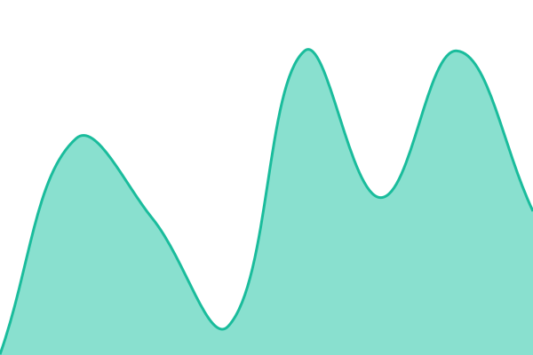

# [📈 Live Status](https://status.cliproxyapi.xyz): <!--live status--> **🟩 All systems operational**

This repository contains the open-source uptime monitor and status page for [Yuhang Nie(聂宇航)](https://www.szu.edu.cn/), powered by [Upptime](https://github.com/upptime/upptime).

With [Upptime](https://upptime.js.org), you can get your own unlimited and free uptime monitor and status page, powered entirely by a GitHub repository. We use [Issues](https://github.com/YuhangNie/cfmail-status/issues) as incident reports, [Actions](https://github.com/YuhangNie/cfmail-status/actions) as uptime monitors, and [Pages](https://status.cliproxyapi.xyz) for the status page.

<!--start: status pages-->
<!-- This summary is generated by Upptime (https://github.com/upptime/upptime) -->
<!-- Do not edit this manually, your changes will be overwritten -->
<!-- prettier-ignore -->
| URL | Status | History | Response Time | Uptime |
| --- | ------ | ------- | ------------- | ------ |
|  [Mailbox UI](https://mail.cliproxyapi.xyz) | 🟩 Up | [frontend.yml](https://github.com/YuhangNie/cfmail-status/commits/HEAD/history/frontend.yml) | 

 285ms
     
 | 

<a href="https://status.cliproxyapi.xyz/history/frontend">99.64%</a>
    

|  [API Edge](https://apimail.cliproxyapi.xyz/health_check) | 🟩 Up | [api-health.yml](https://github.com/YuhangNie/cfmail-status/commits/HEAD/history/api-health.yml) | 

 256ms
     
 | 

<a href="https://status.cliproxyapi.xyz/history/api-health">99.64%</a>
    

<!--end: status pages-->

[**Visit our status website →**](https://status.cliproxyapi.xyz)

## 📄 License

- Powered by: [Upptime](https://github.com/upptime/upptime)
- Code: [MIT](./LICENSE) © [Anand Chowdhary](https://anandchowdhary.com), supported by [Pabio](https://pabio.com)
- Data in the `./history` directory: [Open Database License](https://opendatacommons.org/licenses/odbl/1-0/)
